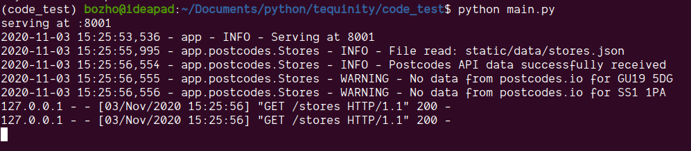

# Tequinity Code Assignment

## About

This project is my submission to the code assignment for the position of a senior engineer at Tequinity.

It's a micro framework, based on Python 3's built in `http` library.

### Architecture, Design Patterns

The design is inspired by both Flask and Django. Class based views and declaration of routes is Django-like. Also, the default file structure and settings file are also inspired by the default Django project sceleton.

Being a minimal web server on the other hand is inspired by Flask. Also, Jinja is used for templating, which is the default templating engine in Flask.

The code to handle the code assignment task is functional and optimized. WebServer responses and running tests is fast.

### Project structure

A) Backend

```
├── app
│   ├── postcodes.py
│   ├── logging.py
│   ├── router.py
│   ├── settings.py
│   ├── static
│   │   ├── data
│   │   │   └── stores.json
│   │   ├── favicon
│   │   │   ├── favicon.ico
│   │   └── templates
│   │       ├── 404.html
│   │       ├── base.html
│   │       ├── index.html
│   │       └── stores.html
│   ├── tests
│   │   ├── test_task_1.py
│   │   └── test_task_2.py
│   └── views
│       ├── base.py
│       └── main.py
├── main.py
├── Pipfile
├── Pipfile.lock
└── README.md
```

B) Client

```
├── package.json
├── package-lock.json
├── public
│   ├── favicon.ico
│   ├── index.html
│   ├── logo192.png
│   ├── logo512.png
│   ├── manifest.json
│   └── robots.txt
├── README.md
├── src
│   ├── App.css
│   ├── App.js
│   ├── App.test.js
│   ├── components
│   │   ├── ContentBox
│   │   │   └── index.js
│   │   ├── GetApiData
│   │   │   └── index.js
│   │   ├── SearchBox
│   │   │   └── index.js
│   │   └── Suggestions
│   │       └── index.js
│   ├── constants
│   │   └── index.js
│   ├── index.css
│   ├── index.js
│   ├── logo.svg
│   ├── pages
│   │   └── Home.js
│   ├── reportWebVitals.js
│   └── setupTests.js
└── yarn.lock
```

## Features

- Serving HTML/JSON views or static files. Based views are in app/views/base and inherited views which are used for actual responsed are in app/views/main.
- Handling of inexisting 404 routes.
- Router - Just a simple router, currently matching existing routes, static files and a default view for 404. Could be generalized with a regular expression based matching.
- Templating with Jinja2. Leverages template inheritance.
- Handling of query strings.
- Communication with the postcodes.io API.
- Logging, here's an example with log level INFO for `/stores`:

  

### Task 1

A) Render a list of stores in alphabetical order.

- The route is `/stores`
- Most of the related code is in `app/postcodes.py`.

B) Build the functionality that allows you to return a list of stores in a given radius of a given postcode in the UK.

- For the second part, for calculating the stores within a distance, check the class method `stores_within_radius` of the `Stores` class in `/app/postcodes.py`. The test is in `app/tests/test_task_1.py`.

### Task 2

A) Build an API that returns stores from the `stores.json`...

- The route for this JSON API is `/api/stores?q=br`.
- Tests are at `app/tests/test_task_2.py`

B) The client app that talkst to the backend is a React app bootstraped with `create-react-app`

## Setting up

### Backend

1. Clone the repo
1. Run `pipenv shell` to setup a pipenv environment.
1. Run `pipenv install` to install the dependencies.
1. Start the app: `python main.py`.

### Client app

- The client app is in `/client`.
- Run `yarn` to install dependencies and then `yarn start` to start the development server.
- You need to have the backend running when developing/using the client app.

## Testing

Pytest framework is used for testing. To test, just run: `pytest` in the root folder.

## Dependencies

### Packages

- Requests - to communicate with the postcodes.io API
- Jinja2 to render templates
- Geopy to measure the distance between two points.
- Pytest for testing.

### Dev Packages

- Flake8 to check code formatting

### Client app

- React/ReactDom - The main dependency, because it's a React app.
- Rebass for components like flexbox, form input etc.
- Axios for fetching data from the API.
- @huse/scroll-position - To read the scroll position.

## Settings

- Port on which the app will run
  `PORT = 8001`

- Use \* to allow all hosts. In order to escape CORS errors.
  `ALLOWED_HOSTS = "*"`

- This is the json file with the stores/postcodes data
  `STORES_DATA_FILE_NAME = "stores.json"`

- This is the API endpoint that returns data for postcodes.
  `POSTCODES_API_URL = "http://api.postcodes.io/postcodes"`

- Entry point of the application or root directory
  from where things like static folder are resolved
  `ROOT = os.path.join(os.getcwd(), "app")`

- Templates loader
  `env = Environment(loader=FileSystemLoader('static/templates'))`

- Request types
  `GET_REQUEST = "GET"`

## Contributing

### To add a new route/view:

- Check the base JSON/HTML views in `app/views/base`
- Create a view for your purposes.
- Add a route to the URLs in `app/router.py`
  That should be enough for simple use cases.

## Answers

### If you had chosen to spend more time on this test, what would you have done differently?

Developer experience:

- Hot code reloading.
- Shell for easier development and debugging.
- Command line interface.

Framework improvements:

- Better design.
- Regex route matching.

App improvements:

- Create a more precise abstraction for setting content type headers
- More comprehensive handling of error responses.

### Make sure you indicate the time you have spent in the README.md file among other metadata.

All in all, from research and design, to implementation and review, it took me about 12 hours of work on this project. I enjoyed the task and worked without pushing myself to finish sooner. Actually, I think that building a web framework would be a benefitial experience for every programmer, no matter their level of expertise. I am glad I worked on this project.

### What part did you find the hardest? What part are you most proud of? In both cases, why?

- I am proud that the responses are fast to generate, because of the optimized data operations.
- The hardest thing is doing good enough for a limited time. I just think of things to add, and this list of features is only getting bigger.

### What is one thing we could do to improve this test?

The documentation recommends not to use a web framework, but it's not indicated what kind of a server should be used to serve the HTML/JSON.

I would also add that it can be better explained about how the client side application looks like. Results vs. suggestions were confusing to me. You can just include a sketch, which would make it much easier.
